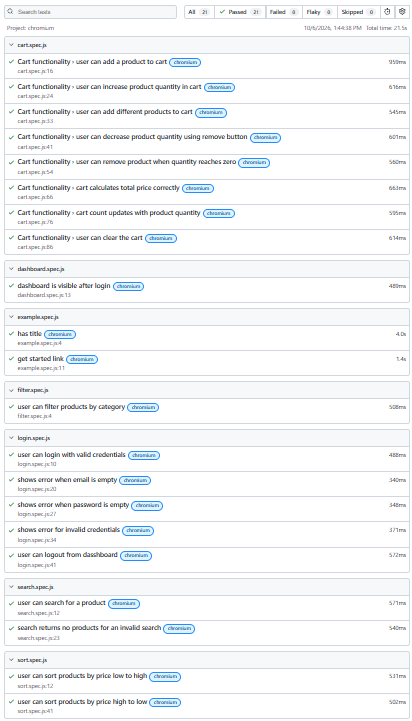

# Playwright Web Testing Suite


Automated end-to-end tests written in Playwright (JavaScript) for a small shopping web app I built for practice. The app has login, product search, category filter, price sorting and a cart.

**Live app:** https://mru8.github.io/playwright-web-testing-suite/

Test login: `test@example.com` / `Test@123`

## What's tested

| File | What it covers | Tests |
|---|---|---|
| login.spec.js | valid login, empty email, empty password, wrong credentials, logout | 5 |
| dashboard.spec.js | dashboard shows after login | 1 |
| search.spec.js | search for a product, search with no match | 2 |
| filter.spec.js | filter by category | 1 |
| sort.spec.js | price low to high, high to low | 2 |
| cart.spec.js | add, increase, decrease, remove, total, count, clear | 8 |

Total: 21 tests, all running on every push through GitHub Actions.

## Project structure

```
app/        the test application (HTML, CSS, JS)
pages/      page objects (LoginPage, DashboardPage)
tests/      test files
.github/    GitHub Actions workflow
```

I used the Page Object Model: page objects hold the actions (logging in, adding a product, sorting), and the tests hold the assertions. I kept assertions out of the page objects on purpose, so each test shows what it expects to happen. Navigation is in `beforeEach`, but login isn't, because some tests need to start from the login page.

## Run it yourself

```
npm install
npx playwright install chromium
npx playwright test --project=chromium
npx playwright show-report
```

The config starts the app by itself, so you don't need to open anything first.

## Test report



## Tools

JavaScript, Playwright, Page Object Model, GitHub Actions